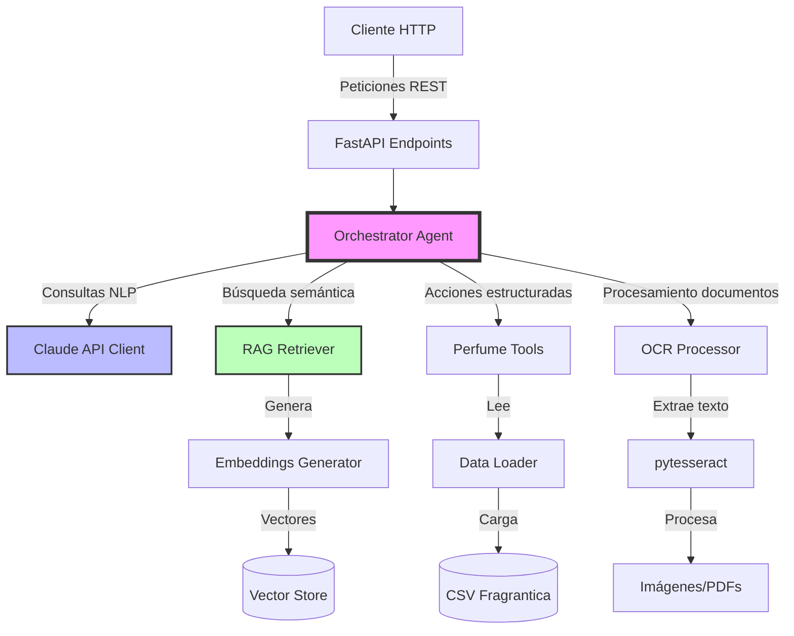
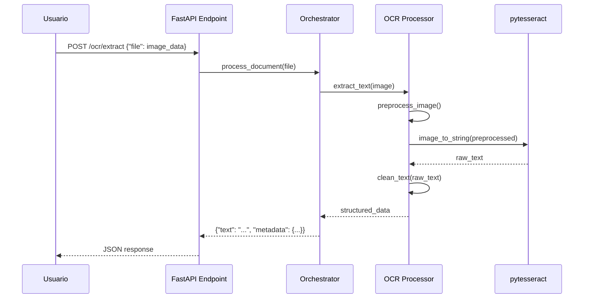

# Documento de Diseño: PerfumeShop AI

## Resumen General

PerfumeShop AI es un proyecto de aprendizaje guiado diseñado para facilitar la transición de desarrollador web (Adobe Commerce/Magento) a IA Engineer. El proyecto implementa un asistente conversacional inteligente que ayuda a usuarios a descubrir y recomendar perfumes basándose en un catálogo de Fragrantica.

El sistema combina múltiples tecnologías de IA modernas: Claude API para procesamiento de lenguaje natural, RAG (Retrieval-Augmented Generation) para búsqueda semántica en el catálogo, Function Calling para acciones estructuradas, y OCR para procesamiento de documentos. La arquitectura está diseñada con enfoque pedagógico, priorizando modularidad, claridad y progresión incremental del aprendizaje.

El proyecto sigue un plan de 11 días donde cada componente se implementa gradualmente, permitiendo al desarrollador aprender haciendo con guía pero sin soluciones completas predefinidas.

## Arquitectura



````

## Diagramas de Secuencia

### Flujo Principal: Consulta de Usuario

```mermaid
sequenceDiagram
    participant U as Usuario
    participant API as FastAPI Endpoint
    participant O as Orchestrator
    participant C as Claude Client
    participant T as Perfume Tools
    participant R as RAG Retriever

    U->>API: POST /chat {"message": "Busco perfume fresco para verano"}
    API->>O: process_query(message)
    O->>C: send_message(prompt + tools)
    C->>C: Analiza intención
    C-->>O: tool_use: search_perfumes(season="summer", notes=["fresh"])
    O->>T: search_perfumes(filters)
    T->>R: semantic_search("fresh summer perfume")
    R-->>T: [perfumes relevantes]
    T-->>O: [resultados filtrados]
    O->>C: send_tool_result(results)
    C-->>O: Respuesta en lenguaje natural
    O-->>API: {"response": "Te recomiendo...", "perfumes": [...]}
    API-->>U: JSON response
````

### Flujo RAG: Búsqueda Semántica

```mermaid
sequenceDiagram
    participant T as Perfume Tools
    participant R as RAG Retriever
    participant E as Embeddings Generator
    participant V as Vector Store
    participant D as Data Loader

    T->>R: semantic_search(query)
    R->>E: generate_embedding(query)
    E-->>R: query_vector
    R->>V: find_similar(query_vector, top_k=5)
    V-->>R: [perfume_ids con scores]
    R->>D: get_perfumes_by_ids(ids)
    D-->>R: [perfume_data]
    R-->>T: [perfumes ordenados por relevancia]
```

### Flujo OCR: Procesamiento de Documentos



## Componentes e Interfaces

### Componente 1: Claude API Client

**Propósito**: Gestionar la comunicación con la API de Claude (Anthropic), incluyendo autenticación, envío de mensajes, manejo de tools (function calling), y gestión de errores.

**Interface**:

```python
from typing import List, Dict, Any, Optional
from anthropic import Anthropic

class ClaudeClient:
    def __init__(self, api_key: str, model: str = "claude-3-5-sonnet-20241022"):
        """Inicializa el cliente de Claude."""
        pass

    def send_message(
        self,
        messages: List[Dict[str, str]],
        tools: Optional[List[Dict[str, Any]]] = None,
        max_tokens: int = 1024
    ) -> Dict[str, Any]:
        """Envía un mensaje a Claude y retorna la respuesta."""
        pass

    def create_tool_result(self, tool_use_id: str, content: Any) -> Dict[str, Any]:
        """Crea un mensaje de resultado de tool para enviar a Claude."""
        pass
```

**Responsabilidades**:

- Autenticación con API key de Anthropic
- Construcción de mensajes en formato correcto (system, user, assistant)
- Envío de tools definitions para function calling
- Manejo de respuestas con tool_use blocks
- Gestión de errores de API (rate limits, timeouts, errores de validación)
- Logging de interacciones para debugging

### Componente 2: Data Loader

**Propósito**: Cargar, limpiar y proporcionar acceso al catálogo de perfumes desde el CSV de Fragrantica.

**Interface**:

```python
import pandas as pd
from typing import List, Dict, Optional

class DataLoader:
    def __init__(self, csv_path: str):
        """Carga el CSV de Fragrantica en memoria."""
        pass

    def load_data(self) -> pd.DataFrame:
        """Carga y limpia el CSV."""
        pass

    def get_all_perfumes(self) -> List[Dict[str, Any]]:
        """Retorna todos los perfumes como lista de diccionarios."""
        pass

    def get_perfume_by_id(self, perfume_id: str) -> Optional[Dict[str, Any]]:
        """Busca un perfume por su ID."""
        pass

    def get_perfumes_by_ids(self, ids: List[str]) -> List[Dict[str, Any]]:
        """Busca múltiples perfumes por sus IDs."""
        pass

    def filter_perfumes(self, filters: Dict[str, Any]) -> List[Dict[str, Any]]:
        """Filtra perfumes por criterios (brand, notes, season, etc)."""
        pass
```

**Responsabilidades**:

- Lectura del CSV con pandas
- Limpieza de datos (valores nulos, duplicados, normalización)
- Indexación por ID para búsquedas rápidas
- Filtrado por múltiples criterios
- Validación de estructura de datos

### Componente 3: Perfume Tools

**Propósito**: Implementar las funciones (tools) que Claude puede invocar para buscar, filtrar y recomendar perfumes.

**Interface**:

```python
from typing import List, Dict, Any, Optional

class PerfumeTools:
    def __init__(self, data_loader: DataLoader, rag_retriever: Optional['RAGRetriever'] = None):
        """Inicializa las tools con acceso a datos y RAG."""
        pass

    def get_tools_definitions(self) -> List[Dict[str, Any]]:
        """Retorna las definiciones de tools en formato Anthropic."""
        pass

    def search_perfumes(
        self,
        brand: Optional[str] = None,
        notes: Optional[List[str]] = None,
        season: Optional[str] = None,
        gender: Optional[str] = None,
        max_results: int = 5
    ) -> List[Dict[str, Any]]:
        """Busca perfumes por criterios específicos."""
        pass

    def get_perfume_details(self, perfume_id: str) -> Dict[str, Any]:
        """Obtiene detalles completos de un perfume."""
        pass

    def recommend_similar(self, perfume_id: str, top_k: int = 3) -> List[Dict[str, Any]]:
        """Recomienda perfumes similares usando RAG."""
        pass

    def execute_tool(self, tool_name: str, tool_input: Dict[str, Any]) -> Any:
        """Ejecuta una tool por nombre con sus parámetros."""
        pass
```

**Responsabilidades**:

- Definir tools en formato JSON Schema para Claude
- Implementar lógica de búsqueda y filtrado
- Integrar con RAG para recomendaciones semánticas
- Validar parámetros de entrada
- Formatear resultados para Claude

### Componente 4: Embeddings Generator

**Propósito**: Generar embeddings vectoriales de descripciones de perfumes para búsqueda semántica.

**Interface**:

```python
import numpy as np
from typing import List, Union

class EmbeddingsGenerator:
    def __init__(self, model_name: str = "sentence-transformers/all-MiniLM-L6-v2"):
        """Inicializa el modelo de embeddings."""
        pass

    def generate_embedding(self, text: str) -> np.ndarray:
        """Genera embedding para un texto."""
        pass

    def generate_embeddings_batch(self, texts: List[str]) -> np.ndarray:
        """Genera embeddings para múltiples textos."""
        pass

    def save_embeddings(self, embeddings: np.ndarray, filepath: str) -> None:
        """Guarda embeddings en disco."""
        pass

    def load_embeddings(self, filepath: str) -> np.ndarray:
        """Carga embeddings desde disco."""
        pass
```

**Responsabilidades**:

- Cargar modelo de sentence-transformers
- Generar embeddings de 384 dimensiones
- Procesamiento por lotes para eficiencia
- Persistencia de embeddings en disco
- Normalización de vectores

### Componente 5: RAG Retriever

**Propósito**: Implementar búsqueda por similitud coseno sobre embeddings de perfumes.

**Interface**:

```python
import numpy as np
from typing import List, Tuple, Dict, Any

class RAGRetriever:
    def __init__(self, embeddings_generator: EmbeddingsGenerator, data_loader: DataLoader):
        """Inicializa el retriever con generador de embeddings y datos."""
        pass

    def build_index(self, perfumes: List[Dict[str, Any]]) -> None:
        """Construye índice de embeddings para todos los perfumes."""
        pass

    def semantic_search(self, query: str, top_k: int = 5) -> List[Dict[str, Any]]:
        """Busca perfumes más similares a la query."""
        pass

    def find_similar_to_perfume(self, perfume_id: str, top_k: int = 3) -> List[Dict[str, Any]]:
        """Encuentra perfumes similares a uno dado."""
        pass

    def _cosine_similarity(self, vec1: np.ndarray, vec2: np.ndarray) -> float:
        """Calcula similitud coseno entre dos vectores."""
        pass
```

**Responsabilidades**:

- Construir índice de embeddings al inicio
- Calcular similitud coseno eficientemente
- Retornar top-k resultados ordenados por score
- Cachear embeddings para evitar recálculos
- Integrar con DataLoader para enriquecer resultados

### Componente 6: Orchestrator Agent

**Propósito**: Orquestar el flujo conversacional entre usuario, Claude y las tools disponibles.

**Interface**:

```python
from typing import List, Dict, Any

class OrchestratorAgent:
    def __init__(
        self,
        claude_client: ClaudeClient,
        perfume_tools: PerfumeTools,
        ocr_processor: Optional['OCRProcessor'] = None
    ):
        """Inicializa el orquestador con sus dependencias."""
        pass

    def process_query(self, user_message: str, conversation_history: List[Dict] = None) -> Dict[str, Any]:
        """Procesa una consulta del usuario y retorna respuesta."""
        pass

    def _handle_tool_use(self, tool_use_block: Dict[str, Any]) -> Any:
        """Ejecuta una tool solicitada por Claude."""
        pass

    def _build_system_prompt(self) -> str:
        """Construye el system prompt para Claude."""
        pass
```

**Responsabilidades**:

- Mantener contexto conversacional
- Construir prompts con instrucciones del sistema
- Detectar y ejecutar tool_use de Claude
- Manejar múltiples turnos de conversación
- Gestionar errores y fallbacks
- Logging de interacciones completas

### Componente 7: OCR Document Processor

**Propósito**: Extraer texto de imágenes y documentos usando pytesseract.

**Interface**:

```python
from PIL import Image
from typing import Dict, Any, Optional
import numpy as np

class OCRProcessor:
    def __init__(self, tesseract_path: Optional[str] = None):
        """Inicializa el procesador OCR."""
        pass

    def extract_text(self, image_path: str, lang: str = 'eng') -> str:
        """Extrae texto de una imagen."""
        pass

    def extract_from_bytes(self, image_bytes: bytes, lang: str = 'eng') -> str:
        """Extrae texto de bytes de imagen."""
        pass

    def preprocess_image(self, image: Image.Image) -> Image.Image:
        """Preprocesa imagen para mejorar OCR (escala de grises, threshold, etc)."""
        pass

    def extract_structured_data(self, image_path: str) -> Dict[str, Any]:
        """Extrae y estructura datos de documentos de perfumes."""
        pass
```

**Responsabilidades**:

- Configuración de pytesseract
- Preprocesamiento de imágenes (escala de grises, binarización, denoising)
- Extracción de texto con OCR
- Limpieza y estructuración de texto extraído
- Soporte para múltiples idiomas
- Manejo de errores de lectura

### Componente 8: FastAPI Endpoints

**Propósito**: Exponer API REST para interactuar con el sistema.

**Interface**:

```python
from fastapi import FastAPI, UploadFile, HTTPException
from pydantic import BaseModel
from typing import List, Dict, Any, Optional

class ChatRequest(BaseModel):
    message: str
    conversation_id: Optional[str] = None

class ChatResponse(BaseModel):
    response: str
    perfumes: Optional[List[Dict[str, Any]]] = None
    conversation_id: str

app = FastAPI(title="PerfumeShop AI API")

@app.post("/chat", response_model=ChatResponse)
async def chat(request: ChatRequest) -> ChatResponse:
    """Endpoint principal de chat."""
    pass

@app.post("/ocr/extract")
async def extract_text_from_image(file: UploadFile) -> Dict[str, Any]:
    """Extrae texto de imagen subida."""
    pass

@app.get("/perfumes/{perfume_id}")
async def get_perfume(perfume_id: str) -> Dict[str, Any]:
    """Obtiene detalles de un perfume."""
    pass

@app.get("/health")
async def health_check() -> Dict[str, str]:
    """Health check del servicio."""
    pass
```

**Responsabilidades**:

- Definir endpoints REST
- Validación de requests con Pydantic
- Manejo de archivos subidos
- Gestión de sesiones conversacionales
- Manejo de errores HTTP
- Documentación automática con OpenAPI

## Modelos de Datos

### Modelo 1: Perfume

```python
from typing import List, Optional
from pydantic import BaseModel, Field

class Perfume(BaseModel):
    id: str = Field(..., description="ID único del perfume")
    name: str = Field(..., description="Nombre del perfume")
    brand: str = Field(..., description="Marca del perfume")
    notes: List[str] = Field(default_factory=list, description="Notas olfativas")
    season: Optional[str] = Field(None, description="Temporada recomendada")
    gender: Optional[str] = Field(None, description="Género objetivo")
    description: Optional[str] = Field(None, description="Descripción del perfume")
    rating: Optional[float] = Field(None, ge=0, le=5, description="Rating promedio")
    year: Optional[int] = Field(None, description="Año de lanzamiento")

    class Config:
        json_schema_extra = {
            "example": {
                "id": "dior-sauvage",
                "name": "Sauvage",
                "brand": "Dior",
                "notes": ["bergamot", "pepper", "ambroxan"],
                "season": "all-year",
                "gender": "masculine",
                "rating": 4.5,
                "year": 2015
            }
        }
```

**Reglas de Validación**:

- `id` debe ser único y no vacío
- `name` y `brand` son obligatorios
- `notes` debe ser lista de strings (puede estar vacía)
- `rating` debe estar entre 0 y 5 si está presente
- `year` debe ser mayor a 1900 si está presente
- `season` debe ser uno de: "spring", "summer", "fall", "winter", "all-year"
- `gender` debe ser uno de: "masculine", "feminine", "unisex"

### Modelo 2: ConversationMessage

```python
from typing import Literal, Optional, Dict, Any
from pydantic import BaseModel, Field

class ConversationMessage(BaseModel):
    role: Literal["user", "assistant"] = Field(..., description="Rol del mensaje")
    content: str = Field(..., description="Contenido del mensaje")
    tool_use: Optional[Dict[str, Any]] = Field(None, description="Información de tool use si aplica")
    timestamp: Optional[str] = Field(None, description="Timestamp del mensaje")
```

**Reglas de Validación**:

- `role` debe ser exactamente "user" o "assistant"
- `content` no puede estar vacío
- `tool_use` es opcional y contiene metadata de function calling
- `timestamp` debe estar en formato ISO 8601 si está presente

### Modelo 3: ToolDefinition

```python
from typing import Dict, Any, List
from pydantic import BaseModel, Field

class ToolParameter(BaseModel):
    type: str
    description: str
    enum: Optional[List[str]] = None

class ToolDefinition(BaseModel):
    name: str = Field(..., description="Nombre de la tool")
    description: str = Field(..., description="Descripción de qué hace la tool")
    input_schema: Dict[str, Any] = Field(..., description="JSON Schema de parámetros")

    class Config:
        json_schema_extra = {
            "example": {
                "name": "search_perfumes",
                "description": "Busca perfumes por criterios específicos",
                "input_schema": {
                    "type": "object",
                    "properties": {
                        "brand": {"type": "string", "description": "Marca del perfume"},
                        "notes": {"type": "array", "items": {"type": "string"}},
                        "season": {"type": "string", "enum": ["spring", "summer", "fall", "winter"]}
                    }
                }
            }
        }
```

**Reglas de Validación**:

- `name` debe seguir snake_case
- `description` debe ser clara y concisa
- `input_schema` debe ser JSON Schema válido
- Todos los parámetros deben tener descripciones

### Modelo 4: OCRResult

```python
from typing import Optional, Dict, Any
from pydantic import BaseModel, Field

class OCRResult(BaseModel):
    raw_text: str = Field(..., description="Texto extraído sin procesar")
    cleaned_text: str = Field(..., description="Texto limpio y estructurado")
    confidence: Optional[float] = Field(None, ge=0, le=1, description="Confianza del OCR")
    metadata: Dict[str, Any] = Field(default_factory=dict, description="Metadata adicional")

    class Config:
        json_schema_extra = {
            "example": {
                "raw_text": "DIOR\nSauvage\nEau de Toilette\n100ml",
                "cleaned_text": "Dior Sauvage Eau de Toilette 100ml",
                "confidence": 0.95,
                "metadata": {"language": "eng", "processing_time_ms": 234}
            }
        }
```

**Reglas de Validación**:

- `raw_text` puede contener cualquier texto extraído
- `cleaned_text` debe estar normalizado (sin saltos de línea innecesarios)
- `confidence` debe estar entre 0 y 1 si está presente
- `metadata` puede contener información adicional del procesamiento

## Pseudocódigo Algorítmico

### Algoritmo Principal: Procesamiento de Consulta

```python
def process_query(user_message: str, conversation_history: List[Dict]) -> Dict[str, Any]:
    """
    Procesa una consulta del usuario y retorna respuesta del asistente.

    Precondiciones:
    - user_message es string no vacío
    - conversation_history es lista válida (puede estar vacía)
    - Claude client está inicializado y autenticado
    - Perfume tools están disponibles

    Postcondiciones:
    - Retorna diccionario con 'response' (string) y opcionalmente 'perfumes' (lista)
    - conversation_history se actualiza con nuevos mensajes
    - Si hay tool_use, se ejecuta y se envía resultado a Claude
    - Maneja errores y retorna mensaje de error apropiado

    Invariantes de Bucle:
    - En cada iteración del bucle de tool_use, conversation_history mantiene coherencia
    - Número máximo de iteraciones es 5 (prevenir loops infinitos)
    """
    # Paso 1: Construir mensajes con historial
    messages = build_messages(conversation_history, user_message)

    # Paso 2: Obtener definiciones de tools
    tools = perfume_tools.get_tools_definitions()

    # Paso 3: Enviar a Claude con tools
    response = claude_client.send_message(messages, tools=tools)

    # Paso 4: Procesar respuesta (puede contener tool_use)
    max_iterations = 5
    iteration = 0

    while has_tool_use(response) and iteration < max_iterations:
        # Invariante: iteration < max_iterations
        # Invariante: response contiene tool_use válido

        tool_use_block = extract_tool_use(response)
        tool_name = tool_use_block["name"]
        tool_input = tool_use_block["input"]

        # Ejecutar tool
        tool_result = perfume_tools.execute_tool(tool_name, tool_input)

        # Enviar resultado a Claude
        messages.append(create_assistant_message(response))
        messages.append(create_tool_result_message(tool_use_block["id"], tool_result))

        response = claude_client.send_message(messages, tools=tools)
        iteration += 1

    # Paso 5: Extraer respuesta final
    final_response = extract_text_response(response)
    perfumes_mentioned = extract_perfumes_from_tools(messages)

    return {
        "response": final_response,
        "perfumes": perfumes_mentioned if perfumes_mentioned else None
    }
```

### Algoritmo: Búsqueda Semántica RAG

```python
def semantic_search(query: str, top_k: int = 5) -> List[Dict[str, Any]]:
    """
    Busca perfumes más similares a la query usando embeddings.

    Precondiciones:
    - query es string no vacío
    - top_k es entero positivo mayor a 0
    - Índice de embeddings está construido
    - embeddings_matrix tiene forma (n_perfumes, embedding_dim)

    Postcondiciones:
    - Retorna lista de exactamente min(top_k, n_perfumes) perfumes
    - Perfumes están ordenados por score descendente
    - Cada perfume incluye campo 'similarity_score' entre 0 y 1
    - No modifica el índice de embeddings

    Invariantes de Bucle:
    - Para cada perfume procesado, similarity_scores mantiene orden descendente
    - Todos los scores están entre -1 y 1 (cosine similarity)
    """
    # Paso 1: Generar embedding de la query
    query_embedding = embeddings_generator.generate_embedding(query)

    # Paso 2: Calcular similitud con todos los perfumes
    n_perfumes = len(embeddings_matrix)
    similarity_scores = []

    for i in range(n_perfumes):
        # Invariante: i < n_perfumes
        # Invariante: len(similarity_scores) == i

        perfume_embedding = embeddings_matrix[i]
        score = cosine_similarity(query_embedding, perfume_embedding)
        similarity_scores.append((i, score))

    # Paso 3: Ordenar por score descendente
    similarity_scores.sort(key=lambda x: x[1], reverse=True)

    # Paso 4: Tomar top_k resultados
    top_indices = [idx for idx, score in similarity_scores[:top_k]]
    top_scores = [score for idx, score in similarity_scores[:top_k]]

    # Paso 5: Obtener datos de perfumes y agregar scores
    perfumes = data_loader.get_perfumes_by_ids(top_indices)

    for i, perfume in enumerate(perfumes):
        perfume["similarity_score"] = top_scores[i]

    return perfumes
```

### Algoritmo: Construcción de Índice de Embeddings

```python
def build_index(perfumes: List[Dict[str, Any]]) -> None:
    """
    Construye índice de embeddings para todos los perfumes.

    Precondiciones:
    - perfumes es lista no vacía de diccionarios válidos
    - Cada perfume tiene campos 'id', 'name', 'brand', 'notes', 'description'
    - embeddings_generator está inicializado

    Postcondiciones:
    - embeddings_matrix tiene forma (len(perfumes), embedding_dim)
    - perfume_id_to_index mapea cada perfume_id a su índice
    - Embeddings están normalizados (norma L2 = 1)
    - Índice está guardado en disco para persistencia

    Invariantes de Bucle:
    - Para cada perfume procesado, embeddings_matrix[i] contiene su embedding
    - perfume_id_to_index mantiene mapeo consistente
    """
    n_perfumes = len(perfumes)
    embeddings_list = []
    perfume_id_to_index = {}

    # Paso 1: Generar texto descriptivo para cada perfume
    for i, perfume in enumerate(perfumes):
        # Invariante: i < n_perfumes
        # Invariante: len(embeddings_list) == i
        # Invariante: len(perfume_id_to_index) == i

        # Combinar campos relevantes en texto descriptivo
        text = create_perfume_description(perfume)

        # Generar embedding
        embedding = embeddings_generator.generate_embedding(text)

        # Normalizar embedding
        normalized_embedding = normalize_vector(embedding)

        embeddings_list.append(normalized_embedding)
        perfume_id_to_index[perfume["id"]] = i

    # Paso 2: Convertir a matriz numpy
    embeddings_matrix = np.array(embeddings_list)

    # Paso 3: Guardar en disco
    save_index(embeddings_matrix, perfume_id_to_index)

    # Paso 4: Actualizar estado interno
    self.embeddings_matrix = embeddings_matrix
    self.perfume_id_to_index = perfume_id_to_index

def create_perfume_description(perfume: Dict[str, Any]) -> str:
    """
    Crea texto descriptivo combinando campos del perfume.

    Precondiciones:
    - perfume tiene campos 'name', 'brand', 'notes'

    Postcondiciones:
    - Retorna string no vacío
    - Formato: "{brand} {name}. Notes: {notes}. {description}"
    """
    parts = [
        f"{perfume['brand']} {perfume['name']}",
        f"Notes: {', '.join(perfume.get('notes', []))}",
    ]

    if perfume.get('description'):
        parts.append(perfume['description'])

    return ". ".join(parts)
```

### Algoritmo: Extracción OCR con Preprocesamiento

```python
def extract_text(image_path: str, lang: str = 'eng') -> str:
    """
    Extrae texto de imagen con preprocesamiento para mejorar precisión.

    Precondiciones:
    - image_path es ruta válida a archivo de imagen
    - Archivo existe y es formato soportado (PNG, JPG, TIFF)
    - pytesseract está instalado y configurado
    - lang es código de idioma válido de Tesseract

    Postcondiciones:
    - Retorna string con texto extraído (puede estar vacío si no hay texto)
    - Imagen original no se modifica
    - Imagen preprocesada se descarta después de OCR
    - Maneja errores de lectura y retorna string vacío en caso de fallo

    Invariantes de Bucle:
    - N/A (no hay bucles en este algoritmo)
    """
    # Paso 1: Cargar imagen
    try:
        image = Image.open(image_path)
    except Exception as e:
        log_error(f"Error loading image: {e}")
        return ""

    # Paso 2: Preprocesar imagen
    preprocessed = preprocess_image(image)

    # Paso 3: Aplicar OCR
    try:
        text = pytesseract.image_to_string(preprocessed, lang=lang)
    except Exception as e:
        log_error(f"Error in OCR: {e}")
        return ""

    # Paso 4: Limpiar texto extraído
    cleaned_text = clean_extracted_text(text)

    return cleaned_text

def preprocess_image(image: Image.Image) -> Image.Image:
    """
    Preprocesa imagen para mejorar precisión de OCR.

    Precondiciones:
    - image es objeto PIL Image válido

    Postcondiciones:
    - Retorna nueva imagen preprocesada
    - Imagen original no se modifica
    - Imagen resultante está en escala de grises
    - Imagen resultante tiene contraste mejorado
    """
    # Paso 1: Convertir a escala de grises
    gray = image.convert('L')

    # Paso 2: Aumentar contraste
    enhancer = ImageEnhance.Contrast(gray)
    contrasted = enhancer.enhance(2.0)

    # Paso 3: Aplicar threshold (binarización)
    threshold = 128
    binary = contrasted.point(lambda x: 0 if x < threshold else 255, '1')

    # Paso 4: Redimensionar si es muy pequeña
    width, height = binary.size
    if width < 300 or height < 300:
        scale_factor = max(300 / width, 300 / height)
        new_size = (int(width * scale_factor), int(height * scale_factor))
        binary = binary.resize(new_size, Image.LANCZOS)

    return binary
```

## Funciones Clave con Especificaciones Formales

### Función 1: cosine_similarity()

```python
def cosine_similarity(vec1: np.ndarray, vec2: np.ndarray) -> float:
    """Calcula similitud coseno entre dos vectores."""
    pass
```

**Precondiciones:**

- `vec1` y `vec2` son arrays numpy de 1 dimensión
- `vec1` y `vec2` tienen la misma longitud
- Vectores no son todos ceros (norma > 0)

**Postcondiciones:**

- Retorna float entre -1 y 1
- Retorna 1 si vectores son idénticos en dirección
- Retorna 0 si vectores son ortogonales
- Retorna -1 si vectores son opuestos
- No modifica vec1 ni vec2

**Invariantes de Bucle:** N/A (operación vectorizada)

### Función 2: filter_perfumes()

```python
def filter_perfumes(filters: Dict[str, Any]) -> List[Dict[str, Any]]:
    """Filtra perfumes por múltiples criterios."""
    pass
```

**Precondiciones:**

- `filters` es diccionario válido (puede estar vacío)
- Claves de `filters` son nombres de campos válidos del modelo Perfume
- Valores de `filters` tienen tipos compatibles con los campos
- DataFrame de perfumes está cargado en memoria

**Postcondiciones:**

- Retorna lista de perfumes que cumplen TODOS los filtros (AND lógico)
- Si `filters` está vacío, retorna todos los perfumes
- Orden de resultados es consistente (ordenado por ID)
- No modifica el DataFrame original
- Lista vacía si ningún perfume cumple los criterios

**Invariantes de Bucle:**

- Para cada filtro aplicado, el conjunto de resultados se reduce o mantiene igual
- Todos los perfumes en resultados intermedios cumplen filtros ya aplicados

### Función 3: send_message()

```python
def send_message(
    messages: List[Dict[str, str]],
    tools: Optional[List[Dict[str, Any]]] = None,
    max_tokens: int = 1024
) -> Dict[str, Any]:
    """Envía mensaje a Claude API y retorna respuesta."""
    pass
```

**Precondiciones:**

- `messages` es lista no vacía de diccionarios válidos
- Cada mensaje tiene claves 'role' y 'content'
- `role` es 'user' o 'assistant'
- `tools` es None o lista de definiciones válidas de tools
- `max_tokens` es entero positivo entre 1 y 4096
- API key está configurada y es válida
- Cliente Anthropic está inicializado

**Postcondiciones:**

- Retorna diccionario con estructura de respuesta de Claude
- Respuesta contiene 'content' (lista de bloques de contenido)
- Si hay tool_use, está en formato correcto con 'id', 'name', 'input'
- Lanza excepción si hay error de API (rate limit, auth, etc)
- No modifica la lista `messages` original
- Registra la interacción en logs

**Invariantes de Bucle:** N/A (llamada única a API)

### Función 4: execute_tool()

```python
def execute_tool(tool_name: str, tool_input: Dict[str, Any]) -> Any:
    """Ejecuta una tool por nombre con sus parámetros."""
    pass
```

**Precondiciones:**

- `tool_name` es string no vacío
- `tool_name` corresponde a una tool registrada
- `tool_input` es diccionario con parámetros válidos para la tool
- Parámetros requeridos están presentes en `tool_input`
- Tipos de parámetros coinciden con definición de la tool

**Postcondiciones:**

- Retorna resultado de la tool ejecutada (tipo depende de la tool)
- Si tool no existe, lanza ToolNotFoundError
- Si parámetros son inválidos, lanza ValidationError
- Registra ejecución de tool en logs
- No modifica `tool_input` original

**Invariantes de Bucle:** N/A (dispatch directo a método)

## Ejemplos de Uso

### Ejemplo 1: Consulta Básica de Usuario

```python
# Inicializar componentes
claude_client = ClaudeClient(api_key=os.getenv("ANTHROPIC_API_KEY"))
data_loader = DataLoader(csv_path="data/raw/fragrantica.csv")
perfume_tools = PerfumeTools(data_loader=data_loader)
orchestrator = OrchestratorAgent(claude_client, perfume_tools)

# Procesar consulta
user_message = "Busco un perfume fresco para el verano"
response = orchestrator.process_query(user_message)

print(response["response"])
# Output: "Te recomiendo Acqua di Giò de Giorgio Armani..."

if response["perfumes"]:
    for perfume in response["perfumes"]:
        print(f"- {perfume['brand']} {perfume['name']}")
```

### Ejemplo 2: Búsqueda Semántica con RAG

```python
# Inicializar RAG
embeddings_gen = EmbeddingsGenerator()
data_loader = DataLoader(csv_path="data/raw/fragrantica.csv")
rag_retriever = RAGRetriever(embeddings_gen, data_loader)

# Construir índice (solo una vez)
all_perfumes = data_loader.get_all_perfumes()
rag_retriever.build_index(all_perfumes)

# Buscar perfumes similares
query = "perfume elegante para ocasiones formales"
results = rag_retriever.semantic_search(query, top_k=3)

for perfume in results:
    print(f"{perfume['name']} - Score: {perfume['similarity_score']:.2f}")
```

### Ejemplo 3: Uso de Tools Directamente

```python
# Inicializar tools
data_loader = DataLoader(csv_path="data/raw/fragrantica.csv")
perfume_tools = PerfumeTools(data_loader=data_loader)

# Buscar por criterios específicos
results = perfume_tools.search_perfumes(
    brand="Dior",
    season="summer",
    gender="masculine",
    max_results=5
)

for perfume in results:
    print(f"{perfume['name']} - {perfume['notes']}")

# Obtener detalles de un perfume
perfume = perfume_tools.get_perfume_details("dior-sauvage")
print(perfume)
```

### Ejemplo 4: API REST con FastAPI

```python
# Iniciar servidor
# uvicorn api.endpoints:app --reload

# Cliente HTTP
import requests

# Chat endpoint
response = requests.post(
    "http://localhost:8000/chat",
    json={
        "message": "¿Qué perfume me recomiendas para invierno?",
        "conversation_id": "user-123"
    }
)

data = response.json()
print(data["response"])
print(data["perfumes"])

# OCR endpoint
with open("perfume_label.jpg", "rb") as f:
    files = {"file": f}
    response = requests.post("http://localhost:8000/ocr/extract", files=files)

ocr_data = response.json()
print(ocr_data["cleaned_text"])
```

### Ejemplo 5: Flujo Completo con Tool Use

```python
# Simulación del flujo interno cuando Claude usa tools

# 1. Usuario envía mensaje
user_message = "Busco perfumes de Chanel con notas cítricas"

# 2. Orchestrator construye prompt y envía a Claude
messages = [{"role": "user", "content": user_message}]
tools = perfume_tools.get_tools_definitions()
response = claude_client.send_message(messages, tools=tools)

# 3. Claude responde con tool_use
# response = {
#     "content": [
#         {
#             "type": "tool_use",
#             "id": "toolu_123",
#             "name": "search_perfumes",
#             "input": {"brand": "Chanel", "notes": ["citrus"]}
#         }
#     ]
# }

# 4. Orchestrator ejecuta la tool
tool_result = perfume_tools.execute_tool(
    "search_perfumes",
    {"brand": "Chanel", "notes": ["citrus"]}
)

# 5. Enviar resultado a Claude
messages.append({"role": "assistant", "content": response["content"]})
messages.append({
    "role": "user",
    "content": [
        {
            "type": "tool_result",
            "tool_use_id": "toolu_123",
            "content": json.dumps(tool_result)
        }
    ]
})

# 6. Claude genera respuesta final en lenguaje natural
final_response = claude_client.send_message(messages, tools=tools)
print(final_response["content"][0]["text"])
```

## Propiedades de Corrección

### Propiedad 1: Consistencia de Embeddings

```python
# Para cualquier perfume p y query q:
# Si semantic_search(q) retorna p con score s,
# entonces cosine_similarity(embedding(q), embedding(p)) == s

def test_embedding_consistency():
    query = "perfume fresco cítrico"
    results = rag_retriever.semantic_search(query, top_k=1)

    query_emb = embeddings_gen.generate_embedding(query)
    perfume_emb = rag_retriever.embeddings_matrix[results[0]["index"]]

    expected_score = cosine_similarity(query_emb, perfume_emb)
    actual_score = results[0]["similarity_score"]

    assert abs(expected_score - actual_score) < 1e-6
```

### Propiedad 2: Idempotencia de Filtros

```python
# Aplicar el mismo filtro dos veces debe dar el mismo resultado

def test_filter_idempotence():
    filters = {"brand": "Dior", "season": "summer"}

    results1 = perfume_tools.filter_perfumes(filters)
    results2 = perfume_tools.filter_perfumes(filters)

    assert results1 == results2

    # Aplicar filtro sobre resultados filtrados no cambia nada
    ids1 = [p["id"] for p in results1]
    results3 = [p for p in results2 if p["id"] in ids1]

    assert results1 == results3
```

### Propiedad 3: Monotonía de Top-K

```python
# Si aumentamos k, los primeros k resultados deben mantenerse

def test_topk_monotonicity():
    query = "perfume elegante"

    results_3 = rag_retriever.semantic_search(query, top_k=3)
    results_5 = rag_retriever.semantic_search(query, top_k=5)

    # Los primeros 3 de results_5 deben ser iguales a results_3
    assert results_5[:3] == results_3
```

### Propiedad 4: Validez de Tool Definitions

```python
# Todas las tools deben tener definiciones válidas según JSON Schema

def test_tool_definitions_validity():
    tools = perfume_tools.get_tools_definitions()

    for tool in tools:
        # Debe tener campos requeridos
        assert "name" in tool
        assert "description" in tool
        assert "input_schema" in tool

        # input_schema debe ser JSON Schema válido
        schema = tool["input_schema"]
        assert schema["type"] == "object"
        assert "properties" in schema

        # Todas las propiedades deben tener descripción
        for prop_name, prop_def in schema["properties"].items():
            assert "description" in prop_def
            assert "type" in prop_def
```

### Propiedad 5: Preservación de Datos en Tool Execution

```python
# Ejecutar una tool no debe modificar el estado del catálogo

def test_tool_execution_preserves_data():
    original_count = len(data_loader.get_all_perfumes())
    original_perfume = data_loader.get_perfume_by_id("dior-sauvage")

    # Ejecutar varias tools
    perfume_tools.search_perfumes(brand="Dior")
    perfume_tools.get_perfume_details("dior-sauvage")
    perfume_tools.recommend_similar("dior-sauvage")

    # Verificar que nada cambió
    assert len(data_loader.get_all_perfumes()) == original_count
    assert data_loader.get_perfume_by_id("dior-sauvage") == original_perfume
```

### Propiedad 6: Convergencia de Conversación

```python
# El loop de tool_use debe terminar en máximo 5 iteraciones

def test_conversation_convergence():
    user_message = "Busco perfume fresco"

    # Instrumentar orchestrator para contar iteraciones
    iteration_count = 0
    max_iterations = 5

    response = orchestrator.process_query(user_message)

    # Verificar que terminó
    assert response is not None
    assert "response" in response

    # Verificar que no excedió límite
    assert orchestrator.last_iteration_count <= max_iterations
```

## Manejo de Errores

### Escenario 1: API Key Inválida o Expirada

**Condición**: Claude API retorna error 401 Unauthorized

**Respuesta**:

- ClaudeClient lanza `AuthenticationError` con mensaje descriptivo
- Orchestrator captura la excepción
- Retorna respuesta de error al usuario: "Error de autenticación con Claude API. Verifica tu API key."

**Recuperación**:

- Usuario debe configurar API key válida en `.env`
- Sistema no intenta reintentos automáticos para errores de auth

### Escenario 2: Rate Limit Excedido

**Condición**: Claude API retorna error 429 Too Many Requests

**Respuesta**:

- ClaudeClient detecta error 429
- Extrae tiempo de espera del header `Retry-After`
- Lanza `RateLimitError` con tiempo de espera

**Recuperación**:

- Orchestrator captura la excepción
- Implementa exponential backoff (1s, 2s, 4s)
- Máximo 3 reintentos
- Si falla después de reintentos, retorna error al usuario

### Escenario 3: CSV de Perfumes No Encontrado

**Condición**: Archivo CSV no existe en la ruta especificada

**Respuesta**:

- DataLoader lanza `FileNotFoundError` en `__init__`
- Error se propaga al inicio de la aplicación
- FastAPI no inicia si falta el CSV

**Recuperación**:

- Mostrar mensaje claro: "CSV de perfumes no encontrado en {path}"
- Instrucciones para descargar/colocar el archivo
- Sistema no puede funcionar sin el catálogo

### Escenario 4: Tool Execution Falla

**Condición**: Una tool lanza excepción durante ejecución (ej: parámetros inválidos)

**Respuesta**:

- PerfumeTools captura la excepción
- Registra error en logs con stack trace
- Retorna resultado de error estructurado: `{"error": "mensaje descriptivo"}`

**Recuperación**:

- Orchestrator envía el error a Claude como tool_result
- Claude puede reformular la consulta o pedir aclaraciones al usuario
- Usuario recibe mensaje natural: "No pude encontrar perfumes con esos criterios"

### Escenario 5: Embeddings No Construidos

**Condición**: Se intenta búsqueda semántica sin haber construido el índice

**Respuesta**:

- RAGRetriever detecta que `embeddings_matrix` es None
- Lanza `IndexNotBuiltError` con mensaje claro

**Recuperación**:

- En desarrollo: mostrar error y pedir construir índice
- En producción: construir índice automáticamente al inicio
- Cachear índice en disco para evitar reconstrucción

### Escenario 6: OCR Falla en Imagen

**Condición**: pytesseract no puede extraer texto de la imagen

**Respuesta**:

- OCRProcessor captura excepción de pytesseract
- Registra error con detalles de la imagen
- Retorna OCRResult con `raw_text=""` y `confidence=0`

**Recuperación**:

- Retornar mensaje al usuario: "No se pudo extraer texto de la imagen"
- Sugerir mejorar calidad de imagen o probar con otra
- No bloquear otras funcionalidades del sistema

### Escenario 7: Timeout de API

**Condición**: Claude API no responde en tiempo razonable (>30s)

**Respuesta**:

- ClaudeClient tiene timeout configurado (default 30s)
- Lanza `TimeoutError` si se excede

**Recuperación**:

- Orchestrator captura timeout
- Reintenta una vez con timeout extendido (60s)
- Si falla nuevamente, retorna error al usuario
- Registra incidente para monitoreo

## Estrategia de Testing

### Enfoque de Testing Unitario

El proyecto utiliza pytest como framework principal de testing. Cada componente tiene su propio archivo de tests en el directorio `tests/`.

**Estructura de Tests**:

```
tests/
├── test_claude_client.py      # Tests del cliente de Claude
├── test_data_loader.py         # Tests de carga de datos
├── test_perfume_tools.py       # Tests de tools
├── test_embeddings.py          # Tests de generación de embeddings
├── test_rag_retriever.py       # Tests de búsqueda semántica
├── test_orchestrator.py        # Tests del orquestador
├── test_ocr_processor.py       # Tests de OCR
└── test_api_endpoints.py       # Tests de API REST
```

**Casos de Test Clave**:

1. **ClaudeClient**:
   - Test de autenticación exitosa
   - Test de envío de mensaje simple
   - Test de envío con tools
   - Test de manejo de tool_use en respuesta
   - Test de manejo de errores (401, 429, timeout)
   - Mock de API para tests sin consumir créditos

2. **DataLoader**:
   - Test de carga de CSV válido
   - Test de manejo de CSV con datos faltantes
   - Test de filtrado por múltiples criterios
   - Test de búsqueda por ID
   - Test de performance con catálogo grande

3. **PerfumeTools**:
   - Test de generación de tool definitions
   - Test de ejecución de cada tool
   - Test de validación de parámetros
   - Test de integración con DataLoader
   - Test de manejo de errores en tools

4. **RAGRetriever**:
   - Test de construcción de índice
   - Test de búsqueda semántica
   - Test de similitud coseno
   - Test de ordenamiento por score
   - Test de persistencia de embeddings

5. **Orchestrator**:
   - Test de flujo completo de conversación
   - Test de manejo de tool_use loop
   - Test de límite de iteraciones
   - Test de construcción de prompts
   - Test de manejo de errores

### Enfoque de Property-Based Testing

Se utiliza `hypothesis` para property-based testing de funciones críticas.

**Biblioteca**: hypothesis (Python)

**Propiedades a Testear**:

1. **Cosine Similarity**:
   - Propiedad: `cosine_similarity(v, v) == 1.0` para cualquier vector v
   - Propiedad: `cosine_similarity(v1, v2) == cosine_similarity(v2, v1)` (simetría)
   - Propiedad: `-1 <= cosine_similarity(v1, v2) <= 1` (rango válido)

2. **Filter Perfumes**:
   - Propiedad: Aplicar filtro dos veces da mismo resultado (idempotencia)
   - Propiedad: Filtro vacío retorna todos los perfumes
   - Propiedad: Agregar más filtros reduce o mantiene resultados

3. **Embeddings Generation**:
   - Propiedad: Mismo texto genera mismo embedding
   - Propiedad: Embeddings tienen dimensión correcta (384)
   - Propiedad: Embeddings normalizados tienen norma L2 ≈ 1

4. **Top-K Search**:
   - Propiedad: Resultados están ordenados por score descendente
   - Propiedad: Aumentar k incluye resultados previos (monotonía)
   - Propiedad: k=1 retorna el perfume más similar

### Enfoque de Testing de Integración

Tests que verifican interacción entre múltiples componentes.

**Escenarios de Integración**:

1. **Flujo Completo de Chat**:
   - Usuario envía mensaje → Orchestrator → Claude → Tool → Respuesta
   - Verificar que todos los componentes se comunican correctamente
   - Usar mocks para Claude API

2. **Pipeline RAG Completo**:
   - Cargar datos → Generar embeddings → Construir índice → Buscar
   - Verificar que resultados son relevantes
   - Medir tiempo de respuesta

3. **API REST End-to-End**:
   - Iniciar servidor FastAPI
   - Hacer requests HTTP reales
   - Verificar respuestas y códigos de estado
   - Usar TestClient de FastAPI

## Consideraciones de Performance

### Optimización 1: Caching de Embeddings

**Problema**: Generar embeddings para todo el catálogo es costoso (varios segundos para miles de perfumes).

**Solución**:

- Generar embeddings una sola vez al inicio
- Guardar embeddings en disco (formato numpy .npy)
- Cargar embeddings desde disco en inicios posteriores
- Regenerar solo si el catálogo cambia

**Impacto**: Reduce tiempo de inicio de ~30s a ~2s para catálogo de 5000 perfumes.

### Optimización 2: Búsqueda Vectorial Eficiente

**Problema**: Calcular similitud coseno con todos los perfumes es O(n).

**Solución Actual**: Búsqueda lineal (suficiente para <10k perfumes)

**Solución Futura**: Si el catálogo crece >50k perfumes:

- Usar FAISS (Facebook AI Similarity Search)
- Índice IVF (Inverted File Index) para búsqueda aproximada
- Reduce complejidad a O(log n)

### Optimización 3: Batch Processing de Embeddings

**Problema**: Generar embeddings uno por uno es ineficiente.

**Solución**:

- Usar `generate_embeddings_batch()` para procesar múltiples textos
- Aprovechar paralelización de sentence-transformers
- Batch size óptimo: 32-64 textos

**Impacto**: Reduce tiempo de generación en ~70%.

### Optimización 4: Lazy Loading de Modelos

**Problema**: Cargar modelo de embeddings al inicio aumenta tiempo de arranque.

**Solución**:

- Cargar modelo solo cuando se necesita por primera vez
- Mantener modelo en memoria después de primera carga
- Usar singleton pattern para EmbeddingsGenerator

### Optimización 5: Connection Pooling para API

**Problema**: Crear nueva conexión HTTP para cada request a Claude API.

**Solución**:

- Cliente Anthropic ya usa connection pooling internamente
- Reutilizar misma instancia de ClaudeClient
- Configurar timeouts apropiados (30s default)

## Consideraciones de Seguridad

### Seguridad 1: Protección de API Keys

**Riesgo**: API key de Anthropic expuesta en código o logs.

**Mitigación**:

- Almacenar API key en archivo `.env` (no subir a git)
- Usar `python-dotenv` para cargar variables de entorno
- Agregar `.env` a `.gitignore`
- Nunca loggear API keys completas (solo últimos 4 caracteres)
- Rotar API keys periódicamente

### Seguridad 2: Validación de Inputs de Usuario

**Riesgo**: Inyección de prompts maliciosos o inputs excesivamente largos.

**Mitigación**:

- Limitar longitud de mensajes de usuario (max 2000 caracteres)
- Sanitizar inputs antes de enviar a Claude
- Usar Pydantic para validación de tipos
- Implementar rate limiting en API endpoints
- Rechazar inputs con patrones sospechosos

### Seguridad 3: Protección contra Prompt Injection

**Riesgo**: Usuario intenta manipular el system prompt o extraer información sensible.

**Mitigación**:

- System prompt bien diseñado con instrucciones claras
- No incluir información sensible en prompts
- Validar que tool_use solo ejecuta tools permitidas
- Loggear intentos sospechosos
- Implementar filtros de contenido

### Seguridad 4: Manejo Seguro de Archivos Subidos

**Riesgo**: Usuario sube archivos maliciosos para OCR.

**Mitigación**:

- Validar tipo MIME de archivos (solo imágenes)
- Limitar tamaño de archivo (max 10MB)
- Escanear archivos con antivirus si es producción
- Procesar archivos en sandbox aislado
- Eliminar archivos temporales después de procesamiento
- No ejecutar código de archivos subidos

### Seguridad 5: Rate Limiting y DoS Protection

**Riesgo**: Abuso de API causando costos excesivos o denegación de servicio.

**Mitigación**:

- Implementar rate limiting por IP (ej: 10 requests/minuto)
- Usar FastAPI middleware para rate limiting
- Monitorear uso de API de Anthropic
- Establecer presupuesto máximo mensual
- Implementar circuit breaker si se excede límite

### Seguridad 6: Logging y Auditoría

**Riesgo**: Falta de visibilidad sobre uso del sistema y posibles ataques.

**Mitigación**:

- Loggear todas las interacciones (sin datos sensibles)
- Registrar IPs, timestamps, y acciones
- Usar niveles de log apropiados (INFO, WARNING, ERROR)
- Rotar logs periódicamente
- Monitorear logs para patrones anómalos
- No loggear contenido completo de conversaciones en producción

## Dependencias

### Dependencias Core

```
# API y Cliente
anthropic==0.39.0           # Cliente oficial de Claude API
python-dotenv==1.0.0        # Manejo de variables de entorno

# Framework Web
fastapi==0.115.0            # Framework API REST
uvicorn[standard]==0.32.0   # Servidor ASGI
pydantic==2.9.0             # Validación de datos

# Procesamiento de Datos
pandas==2.2.0               # Manipulación de datos
numpy==1.26.0               # Operaciones numéricas

# Machine Learning / RAG
sentence-transformers==3.3.0  # Generación de embeddings
torch==2.5.0                  # Backend para transformers

# OCR
pytesseract==0.3.13         # Wrapper de Tesseract OCR
Pillow==11.0.0              # Procesamiento de imágenes

# Testing
pytest==8.3.0               # Framework de testing
pytest-asyncio==0.24.0      # Tests asíncronos
hypothesis==6.122.0         # Property-based testing
httpx==0.28.0               # Cliente HTTP para tests
```

### Dependencias de Sistema

**Tesseract OCR**:

- Requerido para pytesseract
- Instalación en Ubuntu/Debian: `sudo apt-get install tesseract-ocr`
- Instalación en macOS: `brew install tesseract`
- Instalación en Windows: Descargar instalador desde GitHub

**Python**:

- Versión mínima: Python 3.9
- Versión recomendada: Python 3.11 o 3.12

### Dependencias Opcionales

```
# Desarrollo
black==24.10.0              # Formateo de código
ruff==0.8.0                 # Linter rápido
mypy==1.13.0                # Type checking

# Monitoreo y Logging
loguru==0.7.2               # Logging mejorado

# Performance (futuro)
faiss-cpu==1.9.0            # Búsqueda vectorial eficiente
```

### Notas sobre Dependencias

1. **sentence-transformers**: Descarga automáticamente el modelo `all-MiniLM-L6-v2` (~80MB) en primera ejecución.

2. **torch**: Instalación puede ser grande (~2GB). Para CPU-only, usar: `pip install torch --index-url https://download.pytorch.org/whl/cpu`

3. **anthropic**: Requiere API key válida. Obtener en: https://console.anthropic.com/

4. **pytesseract**: Requiere Tesseract OCR instalado en el sistema. No es un paquete Python puro.

5. **Compatibilidad**: Todas las dependencias son compatibles con Windows, macOS y Linux.

## Notas de Implementación Pedagógica

Este proyecto está diseñado como herramienta de aprendizaje progresivo. Cada componente se implementa en días específicos:

**Día 1**: Conexión básica con Claude API

- Implementar `ClaudeClient.__init__()` y `send_message()`
- Aprender sobre API keys, autenticación, y estructura de mensajes
- Primer contacto con LLMs en producción

**Día 3**: Carga y exploración de datos

- Implementar `DataLoader` completo
- Aprender pandas, limpieza de datos, y exploración en notebooks
- Entender la estructura del catálogo de perfumes

**Día 4**: Function Calling con Tools

- Implementar `PerfumeTools` y definiciones de tools
- Aprender sobre function calling, JSON Schema, y structured outputs
- Conectar Claude con acciones estructuradas

**Día 5**: API REST con FastAPI

- Implementar endpoints básicos
- Aprender sobre REST APIs, validación con Pydantic, y documentación automática
- Exponer funcionalidad vía HTTP

**Día 6**: Orquestación de Conversaciones

- Implementar `OrchestratorAgent`
- Aprender sobre flujos conversacionales, manejo de estado, y tool_use loops
- Integrar todos los componentes previos

**Día 7**: RAG y Búsqueda Semántica

- Implementar `EmbeddingsGenerator` y `RAGRetriever`
- Aprender sobre embeddings, similitud coseno, y búsqueda vectorial
- Primer contacto con técnicas de RAG

**Día 8**: Testing y Calidad

- Escribir tests con pytest
- Aprender sobre testing unitario, mocking, y property-based testing
- Asegurar calidad del código

**Día 11**: OCR y Procesamiento de Documentos

- Implementar `OCRProcessor`
- Aprender sobre procesamiento de imágenes y extracción de texto
- Expandir capacidades del sistema

**Principios Pedagógicos**:

- Cada día construye sobre conocimientos previos
- Implementaciones incrementales (no todo a la vez)
- Comentarios TODO guían la implementación
- Errores son oportunidades de aprendizaje
- Preguntas guía antes de soluciones directas
- Énfasis en entender el "por qué" además del "cómo"
